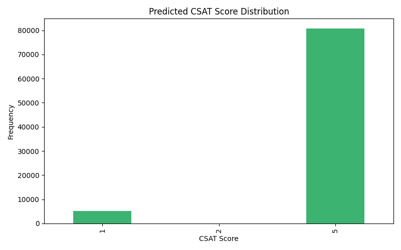
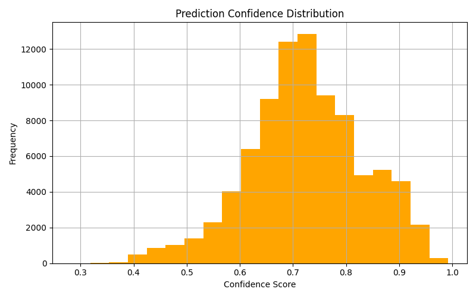
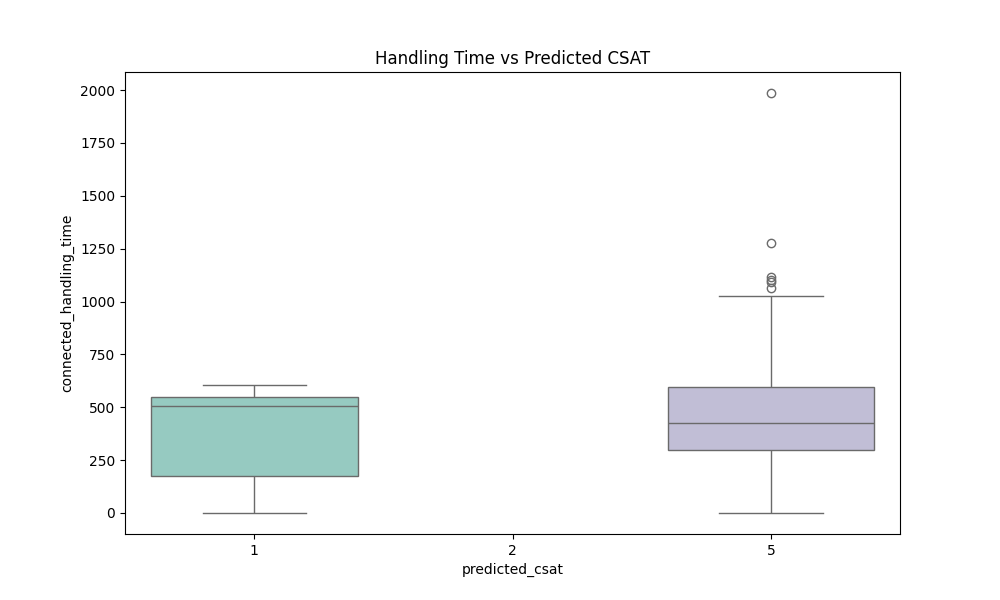
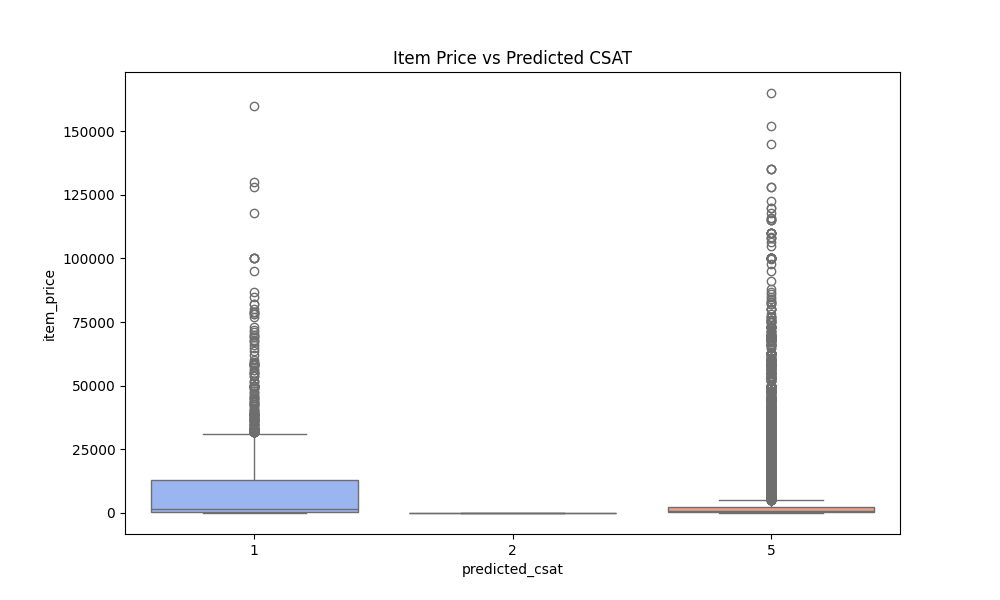
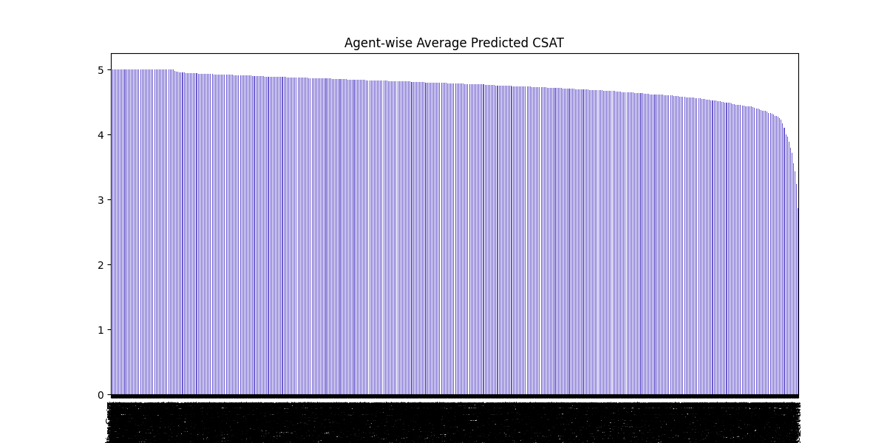
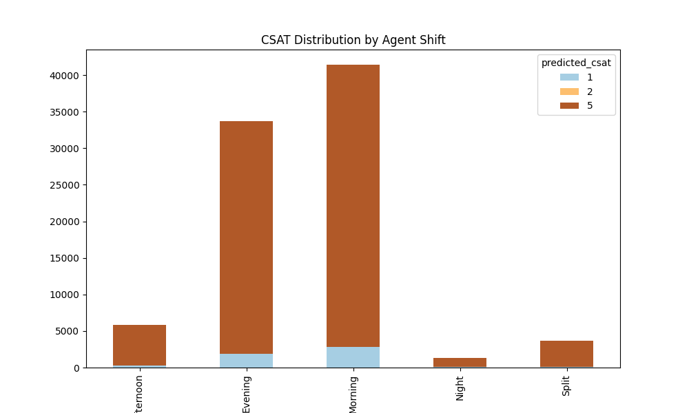

# Flipkart Customer Service Satisfaction Classification

This repository contains the complete end-to-end machine learning pipeline to classify Flipkart customer service satisfaction (CSAT) scores using Google Cloud Platform (GCP).

## 📌 Objective

Predict the CSAT (Customer Satisfaction) score based on support data using a classification model trained with Google Vertex AI AutoML.

---

## 📁 Project Structure

```
Flipkart-csat/
├── cleaned_customer_support_data.csv        # Preprocessed dataset used for training
├── predict_input.csv                        # Input data for batch prediction
├── flipkart_csat_predictions.csv            # Final predictions from Vertex AI model
├── flipkart_csat_notebook.ipynb             # Jupyter notebook (end-to-end pipeline)
├── charts/                                  # Generated visualizations (PNG/CSV)
├── Flipkart_CSAT_Report.pdf                 # Final presentation/report
└── README.md                                # This file
```

---

## 🚀 Pipeline Steps

1. **Data Preparation**
   Cleaned and uploaded CSAT dataset to Google Cloud Storage.

2. **Model Training**
   Trained a classification model using Vertex AI AutoML with a 1-node hour budget.

3. **Evaluation**
   Analyzed accuracy, ROC-AUC, PR-AUC, and feature importance.

4. **Prediction**
   Performed batch prediction and generated confidence scores.

5. **Result Export**
   Combined all results into a single CSV and uploaded to GitHub.

---

## 🔍 Model Details

* **Model Type**: Vertex AI AutoML Tabular (Classification)
* **Target Column**: `csat_score`
* **Evaluation Metrics**:

  * ROC AUC: 0.901
  * PR AUC: 0.727
  * F1 Score: 0.718

---

## 📈 Charts and Visualizations

### 🔍 Prediction Charts

1. **Predicted CSAT Score Distribution**
   

2. **Prediction Confidence Distribution**
   

3. **Handling Time vs Predicted CSAT**
   

4. **Item Price vs Predicted CSAT**
   

5. **Agent-wise Average CSAT**
   

6. **Shift-wise CSAT Distribution**
   

---

## 📦 Dependencies

* Python 3.11
* Google Colab
* Google Cloud SDK
* Libraries: `pandas`, `matplotlib`, `google-cloud-storage`, `google-cloud-aiplatform`, `seaborn`

---

## 🔗 Live Resources

* 🌐 Live Dashboard : https://flipkart-csat-ishan.streamlit.app/
* 🔍 [Prediction Results (CSV)](https://github.com/IHRM-AI/Flipkart-csat/blob/main/flipkart_csat_predictions.csv)
* 📊 Report: `Flipkart_CSAT_Report.pdf`

---

## 👨‍💻 Author

**Ishan Mishra**
| AI/ML Developer | GCP Practitioner
Email: [ihrm.aiml@gmail.com](mailto:ihrm.aiml@gmail.com)

---
